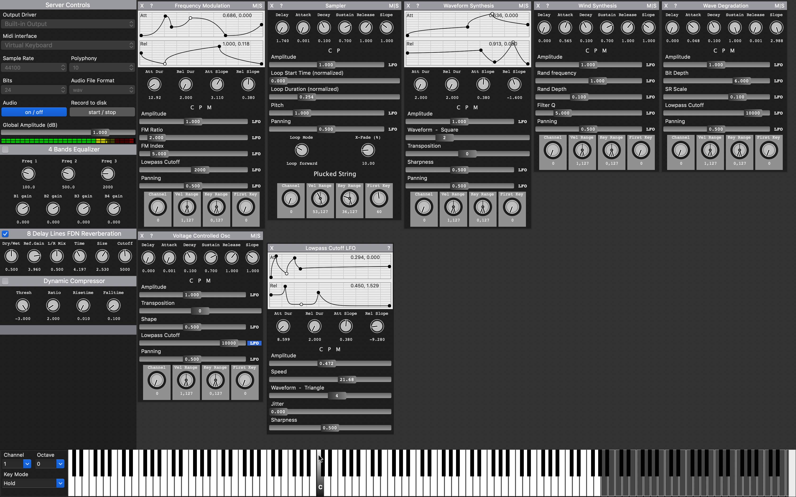

# Zyne_B #

Zyne_B version 1.0.1 is a flexible modular synthesizer (written in Python3) using pyo as its audio engine. 

Zyne_B is a git fork of the **extremely outstanding** work of **Olivier Bélanger**.
The original Zyne code is hosted at [https://github.com/belangeo/zyne](https://github.com/belangeo/zyne) and
pyo code at [https://github.com/belangeo/pyo](https://github.com/belangeo/pyo).

Zyne_B comes with more than 10 builtin modules implementing different kind of 
synthesis engines and provides a simple API to create your own custom modules.

Tutorial on how to create a custom Zyne module:
[Tutorial](https://github.com/belangeo/zyne/blob/wiki/CustomModule.md)

## Installation ##

Zyne_B should run on each OS with Python >= 3.6 and wxpython >= 4.1 installed. It uses Olivier Bélanger's
pyo audio engine which has to be installed as well.

One possible installation scenario:

- install wxpython (version >= 4.1)

`pip3 install wxpython`

For Linux users (esp. Ubuntu) please refer to the [this site](https://extras.wxpython.org/wxPython4/extras/linux/gtk3/)
and pick a matching package URL, e.g. for Ubuntu 20.04

`python3 -m pip install -U -f https://extras.wxpython.org/wxPython4/extras/linux/gtk3/ubuntu-20.04 wxPython`

- make a new folder
- go inside that folder clone the following packages:

`git clone https://github.com/derbibiko/pyo.git`

`git clone https://github.com/derbibiko/zyne.git`

- go inside the folder "pyo" and build it

`python3 setup.py install --use-double`

For Linux users (esp. Ubuntu) install libsndfile1-dev, portaudio19-dev, libportmidi-dev, liblo-dev, and python3-pyaudio first, then run

`python3 setup.py install --use-double --user`

If the compilation of pyo fails, you can try to install the original pyo package via

`pip3 install pyo`

- go inside the folder "zyne" and execute the Python script "Zyne.py"

`python3 Zyne.py`

### How to create a macos App ###

- install `pyinstaller`

`pip3 install pyinstaller`

- execute the following command from Zyne's root directory

`./scripts/builder_pyinstaller_macos.sh`

- you find the app in folder "dist" as "Zyne_B.app"

## Contact ##

For questions and comments please mail to `mail (at) bibiko.de` or use the [issue tracker](https://github.com/derbibiko/zyne_b/issues/new).

